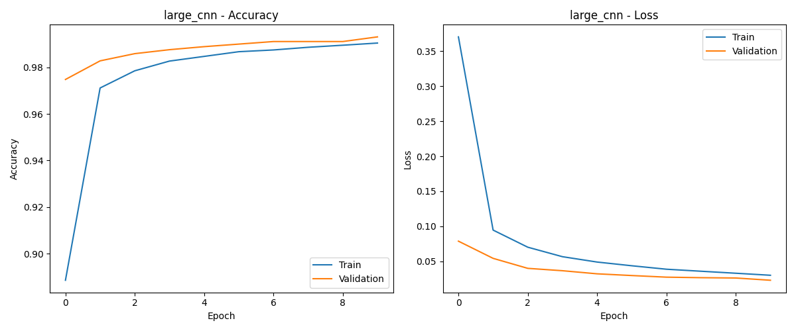

# MNIST Digit Classification with CNN Models

This repository contains an implementation of three different CNN architectures for classifying handwritten digits using the MNIST dataset. The project compares the performance, training time, and architecture complexity of these models.

## Table of Contents
- [Overview](#overview)
- [Requirements](#requirements)
- [CNN Architectures](#cnn-architectures)
- [Results](#results)
- [How to Run](#how-to-run)
- [Project Structure](#project-structure)

## Overview

The MNIST dataset consists of 70,000 grayscale images of handwritten digits (60,000 for training and 10,000 for testing), each 28x28 pixels. This project implements three CNN architectures of increasing complexity to classify these digits:

1. **Simple CNN**: A basic architecture with one convolutional layer
2. **Large CNN**: A moderate architecture with two convolutional layers
3. **Larger CNN**: A complex architecture with multiple convolutional layers and more filters

The performance of each model is compared in terms of accuracy, training time, and number of parameters.

## Requirements

```
tensorflow==2.8.0
numpy==1.22.3
pandas==1.4.2
matplotlib==3.5.1
```

You can install the required packages using:
```bash
pip install -r requirements.txt
```

## CNN Architectures

### 1. Simple CNN
- 1 Conv2D layer (32 filters, 5x5 kernel)
- MaxPooling
- Dropout (0.2)
- Fully connected layer (128 neurons)
- Output layer (10 neurons)

### 2. Large CNN
- 1st Conv2D layer (30 filters, 5x5 kernel)
- MaxPooling
- 2nd Conv2D layer (15 filters, 3x3 kernel)
- MaxPooling
- Dropout (0.2)
- 1st Fully connected layer (128 neurons)
- 2nd Fully connected layer (50 neurons)
- Output layer (10 neurons)

### 3. Larger CNN
- Multiple Conv2D layers with increasing filter counts (64, 128, 192)
- Multiple MaxPooling and Dropout layers
- Fully connected layer (256 neurons)
- Output layer (10 neurons)

## Results

### Sample Digits from the MNIST Dataset


### Model Performance Comparison


### Individual Model Performance

#### Simple CNN


#### Large CNN



#### Larger CNN


## How to Run

1. Clone this repository
2. Install the required packages
3. Run the main script:

```bash
python mnist_classification.py
```

## Project Structure

```
├── mnist_classification.py  # Main script
├── models                   # Saved model files
│   ├── simple_cnn.h5
│   ├── large_cnn.h5
│   └── larger_cnn.h5
├── plots                    # Generated visualizations
│   ├── sample_mnist_images.png
│   ├── simple_cnn_performance.png
│   ├── large_cnn_performance.png
│   ├── larger_cnn_performance.png
│   └── models_comparison.png
├── README.md
└── requirements.txt
```

Feel free to experiment with different architectures and hyperparameters to improve the performance of the models!